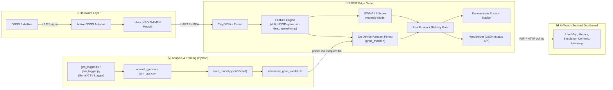

<div align="center">

# 🛰️ GNSS Anti-Spoofing & Jamming Detection System
### *AirWatch Sentinel — A Dual-AI Defense Layer for GPS/GNSS Receivers*

**Edge ML on ESP32 + Real-Time Web Dashboard + Curated Attack-Scenario Dataset**

[](.)
[](.)
[](.)
[](.)
[](./LICENSE)

</div>

---

## 🎬 Live Preview

<p align="center">
  
</p>

<p align="center"><i>AirWatch Sentinel v3.0 — live signal metrics, simulation controls, position gate, and an anti-spoofing risk fusion panel, all streamed straight from the ESP32.</i></p>

---

## 📖 Table of Contents

- [Why This Project Exists](#-why-this-project-exists)
- [Key Features](#-key-features)
- [System Architecture](#-system-architecture)
- [Hardware Build](#-hardware-build)
- [Repository Structure](#-repository-structure)
- [The Attack-Scenario Dataset](#-the-attack-scenario-dataset)
- [The Machine Learning Pipeline](#-the-machine-learning-pipeline)
- [Firmware — On-Device Security Logic](#-firmware--on-device-security-logic)
- [The Dashboard](#-the-dashboard)
- [Getting Started](#-getting-started)
- [Usage](#-usage)
- [Full Dataset & Extra Media (Google Drive)](#-full-dataset--extra-media-google-drive)
- [Roadmap](#-roadmap)
- [Tech Stack](#-tech-stack)
- [Author](#-author)
- [License](#-license)

---

## 🎯 Why This Project Exists

GNSS (GPS/Galileo/GLONASS/BeiDou) receivers implicitly trust every signal they lock onto — which makes them an easy target. Two attacks dominate:

- **Jamming** — flooding the L1/L5 bands with RF noise so the receiver loses its fix entirely.
- **Spoofing / Meaconing** — broadcasting fake (or replayed) satellite signals that are stronger than the real ones, silently dragging the reported position away from the truth.

This project builds an **end-to-end defense stack** for a low-cost GNSS receiver: a physical breadboard rig that captures raw NMEA/UBX data, an **on-device machine-learning classifier** that flags anomalies in real time on the ESP32 itself (no cloud dependency), and a **live web dashboard** that visualizes signal health, trust score, and an attack heatmap — plus a full dataset of real jamming/spoofing/meaconing field trials used to train and validate the models.

## ✨ Key Features

| Category | Details |
|---|---|
| 🧠 **Dual-AI Detection** | An XGBoost model (trained offline in Python) is distilled into a lightweight Random Forest (`gnss_model.h`) and ported to run **directly on the ESP32** via Eloquent ML, alongside a statistical EWMA/Z-score anomaly engine. |
| 📡 **Live Telemetry** | HDOP, satellite count, speed, position drift, Z-anomaly score, satellite-drop rate, speed-jump, and HDOP-spike — all computed per GPS fix. |
| 🛡️ **Stability Gate** | A trust-score gate that blocks position updates when the fused risk score crosses a threshold, preventing a spoofed fix from silently overwriting the last trusted position. |
| 🌀 **Kalman-style Tracker** | A lightweight 2-state (lat/lon + velocity) predictive filter smooths the position and helps flag physically impossible jumps. |
| 🎛️ **Attack Simulation** | Built-in **Simulate Jamming**, **Simulate Spoof Attack**, and **Deep Purge + Resync** controls on the dashboard for live demos and testing — no real jammer required. |
| 🗺️ **Forensic Heatmap** | Risk hot-zones only "burn" on the map once fusion risk exceeds 55%, keeping the visualization signal-rich instead of noisy. |
| 🗃️ **Real Attack Dataset** | 12+ field-collected scenarios (Jamming, Spoofing, Meaconing, and combined Jamming+Spoofing) across multiple power levels and frequency bands, each with raw `mon_rf`, `nav_pvt`, `rinex`, and `.ubx` logs. |

---

## 🧩 System Architecture



---

## 🔧 Hardware Build

<p align="center">
  
</p>

<p align="center"><i>The actual breadboard rig used for data collection: ESP32 dev board (left) wired to a u-blox NEO-6M GPS module (right) with an active patch antenna.</i></p>

**Bill of materials:**

| Component | Purpose |
|---|---|
| ESP32 Dev Module | Runs the parser, feature engine, on-device ML model, and WiFi web server |
| u-blox NEO-6M (or NEO-M9N) GNSS receiver | Provides raw NMEA fixes, satellite count, HDOP, PVT/RF monitor data |
| Active GNSS antenna | Improves cold-fix time and signal margin |
| Breadboard + jumper wires | Prototyping harness |
| USB power / 5V supply | Powers both boards |

**Wiring (typical NEO-6M ↔ ESP32 UART2):**

| GPS Module Pin | ESP32 Pin |
|---|---|
| `TX` | `RX2` (GPIO16) |
| `RX` | `TX2` (GPIO17) |
| `VCC` (3V3/5V) | `3V3` / `VIN` |
| `GND` | `GND` |

> Baud rate used throughout the project: **115200** (see `Serial Monitor` capture below).

<p align="center">
  
</p>

<p align="center"><i>Live serial output from <code>gnss_security_terminal.ino</code> — satellites, HDOP, drift, fused risk, Z-anomaly score, and gate status, printed once per updated fix.</i></p>

---

## 🗂️ Repository Structure

```
GNSS_ANTI_SPOOFING_JAMMING_GPS/
│
├── attack_scenarios_tree/         # Curated, taxonomy-organized attack dataset (see below)
│   ├── Jamming/
│   ├── Spoofing/
│   ├── Meaconing/
│   └── Jamming+Spoofing/
│
├── gnss_security_terminal.ino     # ⚙️ ESP32 firmware (WiFi + GPS parsing + AI fusion + web API)
│                                   #    ↳ shipped in this repo as "GNSS CODE.txt" / GNSS.c
├── gnss_model.h                   # On-device Random Forest, ported from the trained model
│
├── train_model.py                 # Trains the offline XGBoost classifier
├── normal_gps.csv                 # Logged baseline (clean) GPS telemetry
├── jam_gps.csv                    # Logged telemetry captured during jamming
├── advanced_gnss_model.pkl        # Trained XGBoost model (joblib)
├── gnss_detection_model.pkl       # Earlier/alternate trained model
│
├── gps_logger.py                  # Serial → CSV logger for clean sessions
├── jam_logger.py                  # Serial → CSV logger for attack sessions
├── time.py                        # Analyzes attack_scenarios_tree/ timing & session stats
├── analyze_data.ipynb             # Exploratory data analysis notebook
│
├── attack_clusters_tree.json      # Hierarchical summary of all attack scenarios
├── cluster_visualization.html     # Interactive tree/cluster visualization
│
├── app.py                         # Streamlit live dashboard (polls the ESP32 /status API)
│
└── assets/                        # Photos used in this README
```

> **Note:** `GNSS.c` in this repo is a Git patch that materializes the actual sketch, `gnss_security_terminal.ino`. If you're browsing the source, open `GNSS CODE.txt` for the readable version, or apply the patch to get the `.ino` directly.

---

## 🧬 The Attack-Scenario Dataset

`attack_scenarios_tree/` organizes every field trial into a browsable taxonomy:

```
attack_scenarios_tree/
├── Jamming/            {stationary, dynamic} × {power level} × {frequency bands}
├── Spoofing/           {stationary, dynamic} × {power level} × {frequency bands}
├── Meaconing/          {stationary, dynamic} × {power level} × {frequency bands}
└── Jamming+Spoofing/   {stationary, dynamic} × {power level} × {frequency bands}
```

Each leaf scenario folder (e.g. `Jamming/dynamic/High Power (≥10W)/Bands_L1_L2_L5/1.6.4/`) contains:

- `scenario.json` — attack metadata: scenario ID, attack type, transmit power, targeted bands, and a timestamped attack log (start/end events)
- `mon_rf.csv` — receiver RF monitor readings (jamming indicator / noise floor)
- `nav_pvt.csv` — navigation position/velocity/time solution
- `rinex.csv` — raw observation data
- `*.ubx` — raw u-blox binary logs for the session

Scenarios span **jamming power levels from low (≤100 mW) to very high (≥10 W)**, across single and multi-band configurations (L1, L2, L3, L5, E1, E5/E5a/E5b, E6), in both **stationary** and **dynamic (moving)** conditions — giving the model exposure to a wide range of real interference profiles rather than a single synthetic case.

`attack_clusters_tree.json` + `cluster_visualization.html` provide an interactive, explorable summary of the whole dataset, and `time.py` computes aggregate statistics (total attack duration, dynamic vs. stationary ratio, per-type breakdowns) directly from the scenario logs.

---

## 🤖 The Machine Learning Pipeline

1. **Collection** — `gps_logger.py` and `jam_logger.py` tap the ESP32's serial output and log raw fixes to `normal_gps.csv` / `jam_gps.csv`.
2. **Feature engineering** (`train_model.py`) — beyond raw `lat`, `lon`, `speed_kmph`, `numSV`, `hdop`, the pipeline derives:
   - `speed_change` — frame-to-frame speed delta
   - `sat_drop` — satellite-count derivative (sudden signal loss)
   - `hdop_change` — dilution-of-precision derivative
   - `position_jump` — Euclidean lat/lon displacement between fixes
3. **Training** — an `XGBClassifier` (400 trees, depth 8, learning rate 0.03) is trained on an 80/20 split to separate clean vs. jammed/spoofed telemetry, and saved as `advanced_gnss_model.pkl`.
4. **On-device porting** — the trained tree ensemble is distilled into a compact Random Forest and exported as pure C++ (`gnss_model.h`, via Eloquent ML), so inference runs **entirely on the ESP32** with no network round-trip.
5. **Runtime fusion** — on the device, the ML model's vote is combined with a statistical **EWMA/Z-score anomaly detector** (tracking drift, HDOP, and satellite-count baselines) into a single fused **anti-spoof risk** score and a binary **stability gate**.

---

## 🛡️ Firmware — On-Device Security Logic

`gnss_security_terminal.ino` runs the whole defense loop on the ESP32:

- Parses live NMEA sentences with **TinyGPS++** over `HardwareSerial(2)`
- Maintains **EWMA baselines** for drift, HDOP, and satellite count, and derives a Z-anomaly score from live deviations
- Runs the **on-device Random Forest** (`model.predict(...)`) alongside the statistical model for every updated fix
- Tracks position with a lightweight **2-state Kalman-style filter** (lat/lon + velocity)
- Exposes a **`WebServer`** with a JSON `/status` endpoint (satellites, HDOP, drift, risk, Z-score, gate state, AI status) that the dashboard polls
- Supports **Safe Mode**, and simulated **Spoof/Jam** flags for live demos, plus a **Deep Purge + Resync** action that resets detection memory, heat history, and gate state for a clean re-sync

> 🔐 **Before pushing your own firmware to GitHub:** the sketch stores your WiFi `ssid`/`password` as plaintext constants at the top of the file. Replace them with placeholders (or load from a `secrets.h` you `.gitignore`) before making the repo public.

---

## 📊 The Dashboard

`app.py` (Streamlit) and the standalone HTML dashboard both poll the ESP32's `/status` API and render:

- **Signal Metrics** — Satellites, HDOP, Drift, Trust Score, Speed, Z-Anomaly, Satellite Drop, Speed Jump, HDOP Spike
- **Simulation Controls** — one-click **Simulate Spoof Attack**, **Simulate Jamming Event**, and **Deep Purge + Resync**
- **Position & Gate** — live lat/lon, Safe Mode state, Stability Gate (OPEN/BLOCKED), and heat-burn counter
- **Anti-Spoofing Intelligence** — a fused **Fusion Risk** meter with a plain-language status line, and a forensic heatmap that only lights up above the 55% risk threshold

<p align="center">
  
</p>

---

## 🚀 Getting Started

### 1. Flash the firmware

1. Open `GNSS CODE.txt` (or apply `GNSS.c`) in the Arduino IDE as `gnss_security_terminal.ino`.
2. Install libraries: `WiFi`, `WebServer`, `TinyGPSPlus`, `ArduinoJson`.
3. Update the WiFi credentials and wire the NEO-6M as shown in [Hardware Build](#-hardware-build).
4. Select **ESP32 Dev Module**, upload, then open the **Serial Monitor at 115200 baud** to confirm live `Sats / HDOP / Drift / Risk / Z / Gate / Status` output.

### 2. Set up the Python side

```bash
git clone https://github.com/Yogesh-77/GNSS_ANTI_SPOOFING_JAMMING_GPS.git
cd GNSS_ANTI_SPOOFING_JAMMING_GPS

pip install streamlit pandas requests pyserial xgboost scikit-learn joblib
```

### 3. Run the live dashboard

Update `ESP32_URL` in `app.py` to your board's IP address (find it in the Serial Monitor boot log), then:

```bash
streamlit run app.py
```

### 4. (Optional) Re-train the model

```bash
python gps_logger.py     # log a clean baseline session
python jam_logger.py      # log a session while jamming/spoofing
python train_model.py     # retrain and export advanced_gnss_model.pkl
```

---

## 🕹️ Usage

- Power the rig outdoors (or near a window) for a real satellite fix.
- Watch **Trust Score**, **Fusion Risk**, and the **Stability Gate** on the dashboard settle to their normal baseline.
- Hit **Simulate Jamming Event** or **Simulate Spoof Attack** to see the risk score climb, the gate flip to **BLOCKED**, and the heatmap "burn" a hot-zone at the current position.
- Use **Deep Purge + Resync** to reset detection memory and re-baseline after a test.

---

## ☁️ Full Dataset & Extra Media (Google Drive)

The complete raw dataset — full-resolution `.ubx` captures, extended field-trial logs, and additional build photos/videos that don't fit in this repo — is hosted here:

**📁 [GNSS Anti-Spoofing / Anti-Jamming — Full Drive Archive](https://drive.google.com/drive/folders/1NiBHpu8zh0zpMV2djbW56g29uM4IjQa8?usp=sharing)**

Use this if you want the complete binary logs behind `attack_scenarios_tree/`, or the original photo/video documentation of the build.

---

## 🗺️ Roadmap

- [ ] Move WiFi credentials to a `.gitignore`'d `secrets.h`
- [ ] Add multi-constellation (GPS + GLONASS + Galileo) cross-checks to the risk fusion
- [ ] Persist attack logs to flash/SD for offline forensic review
- [ ] Package the dashboard as a standalone PWA for field use without Streamlit
- [ ] Publish benchmark accuracy/F1 numbers for the XGBoost and on-device Random Forest models

---

## 🛠️ Tech Stack

`ESP32` · `Arduino/C++` · `TinyGPS++` · `ArduinoJson` · `Eloquent ML` · `Python` · `XGBoost` · `scikit-learn` · `pandas` · `Streamlit` · `u-blox NEO-6M/M9N`

---

## 👤 Author

**Yogesh** — [GitHub @Yogesh-77](https://github.com/Yogesh-77)

<p align="left">
  
</p>

Contributions, issues, and pull requests are welcome — open an issue first for major changes so we can discuss the approach.

---

## 📄 License

Released under the **MIT License**. See [`LICENSE`](./LICENSE) for details.

<div align="center">

*Built to make one GPS fix a little harder to fool.*

</div>
